# Extra_lab_unicode

Автори: Дмитро Лопушанський, Ярослав Морозевич та Денис Герасимук

У даній додатковій практичній роботі ми реалізували наступні завдання:
- task 1: Порахувати кількість code unit в файлі.
- task 2: Порахувати кількість code point в файлі.
- task 3: Порахувати кількість некоректних байт та вивести їх список, разом із зміщеннями у вихідному файлі.


## Запуск

1) Для того, щоб перевірити коректність роботи проекту, слід спочатку задати параметри у ./configs/config.dat:

- **num_task** = 2 -- номер завдання, яке хочете перевірити

- **encoding** =  -- кодування (utf-8, utf-16 чи utf-32). Його можна навіть не вказувати так як код сам може визначати encoding та endianness  

- **test_file_path** = ../test1.txt -- шлях до тестового файлу, можна вказати свій файл чи використати з наших директорій з уже підготовленими файлами.
 Для перевірки коректності завдання 1 та завдання 2 слід використовувати файли з директорії files, для превірки завдання 3 -- з files_with_errors. 
  
- **path_save_results** = ../results/res.txt -- шлях для збереження результату у файл


Для перевірки можна скористатися також і нашими файлами з директорій files та files_with_errors. Потім слід виконати наступні команли у терміналі.

**Linux**

```bash
/lab_unicode$ mkdir build
/lab_unicode$ cd build/
/lab_unicode/build$ cmake ..
/lab_unicode/build$ make
/lab_unicode/build$ ./lab_unicode
```


**Windows MSYS**

```bash
/lab_unicode$ mkdir build
/lab_unicode$ cd build/
/lab_unicode/build$ cmake -G "MSYS Makefiles" ..
/lab_unicode/build$ make
/lab_unicode/build$ ./lab_unicode.exe
```


**Вивід:**
```
config_params.endianness -- LE
config_params.encoding -- utf-8
Filename ../files/task_test_UTF-8_big.txt
utf-8 Number of code points -- 42
```


2) Також можна використати пайтон скрипт та перевірити коректність роботи коду з файлами, що знаходяться у директоріях files та files_with_errors.
Спочатку слід задати параметри у ./configs/config.json або скористатися вже заготовленими ./configs/config_task1.json, ./configs/config_task2.json
   та ./configs/config_task3.json, що тестують відповідні завдання. Якщо тестувати на своїх файлах з пайтонівським скриптом, то треба буде також створити
   файлик з результатами які очікуєте у форматі json типу як ./results/expected_results_task1.json . Проте ця дорога складніша, тому ми самостійно все для вас підготували.
   Параметри у configs/config.json:

```
{
  "task": "1", -- номер завдання ("1", "2", "3")
  "encoding": "", -- "utf-8", "utf-16", "utf-32", якщо не вказати то код у main.cpp самостійно визначить кодування
  "test_files_dir_path": "../files", -- шлях до директоріії, в якій знаходять файли на яких треба відтестувати
  "path_save_results": "../results/results.txt", -- шлях до файлу в якому слід зберігати результати всіх запусків на файлах, що знаходяться в <path_save_results>
  "path_expected_results": "../results/expected_results_task1.json" -- шлях до перевірочного файлу
}
```


```bash
/lab_unicode$ mkdir build
/lab_unicode$ cd build/
/lab_unicode/build$ cmake ..
/lab_unicode/build$ make
/lab_unicode/build$ python3 ../run_tests.py ../configs/config_task1.json
```


**Вивід:**

```
Binary file already exists
All results correct. Check results_task1.txt and expected_results_task1.json
```


## Підхід до рішення завдань

1) **Task 1**: Порахувати кількість code unit в файлі. 
   
   Щоб її вирішити ми порахували кількість байт у файлі, не включаючи байти для BOM, якщо він є, 
   та  потім просто поділили отриману кількість на довжину код юніта для utf-8, utf-16, utf-32, тобто поділили на 1, 2, 4.
   Перевіряли **коректність** ми у [Jeex hex editor](https://www.ubuntugeek.com/jeex-hexadecimal-editor-for-linux.html) 

2) **Task 2**: Порахувати кількість code point в файлі. 
   
   Для цього ми використали наступні знання з вікіпедії:
- [UTF-8](https://en.wikipedia.org/wiki/UTF-8): просто рахували що 1, 2, 3 чи 4 біти записані подібним чином як на табличці, то вони утворюють один code point. 
Це можна легко зробити просто порахувавши байти, що у бінарному вигляді не починаються з 10, порахували таким чином:

```
if ((i & 0xC0) != 0x80) {
        ++len;
}
```

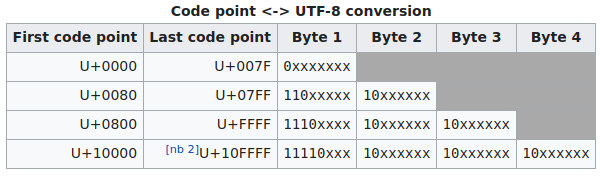


- [UTF-16](https://en.wikipedia.org/wiki/UTF-16): тут використовували знання про сурогатні пари. Тобто рахували їх разом як за один code point.
Якщо це не сурогатна пара, то цей один code unit буде code point

- [UTF-32](https://en.wikipedia.org/wiki/UTF-32): просто рахували кількість байт без BOM та ділили на 4, тобто на довжину код юніта. 
  У цьому випадку код юніт дорівнює код поінту.
  
- для визначення endianness та encoding ми використоували [BOM](https://en.wikipedia.org/wiki/Byte_order_mark) за наступною таблицею

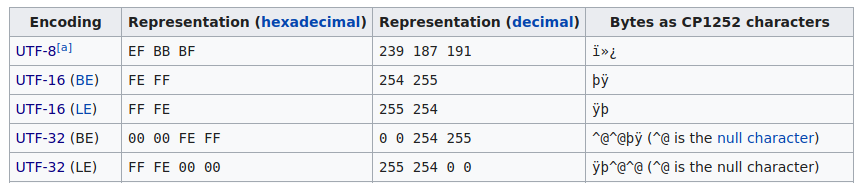

- **для перевірки коректності** ми використовували функцію len у пайтоні, який має підтримку юнікоду та правильно визначає кількість код поінтів.


3) **Task 3**: Порахувати кількість некоректних байт та вивести їх список, разом із зміщеннями у вихідному файлі.

- некоректні байти для **UTF-8** будуть ті байти, що не підпадають під таку структуру як у цій табличці. 
  Тобто такі що у бінарному вигляді починаються на 11хххххх або не підтримують такий порядок.


  

- для **UTF-16** некоректні байти будуть:
  
  - тоді, коли у нас якийсь байт потрапляє у рендж для сурогатних пар (U+D800 to U+DFFF),
  проте не задовільняє умові того що high surrogate має бути у ренджі 0xD800–0xDBFF, та low surrogate -- у ренджі 0xDC00–0xDFFF;
    
  - також тоді, коли utf-16 файл у нас не містить парну кількість байт, не враховуюючи BOM. Code unit для utf-16 завжди містить 16 біт,
    тобто два байти, тому коли останній байт не має собі пари, щоб утворити code unit для utf-16, тоді помилка в останньому байті


- для **UTF-32** некоректні байти будуть:
  - ті байти, що утворюють code unit для utf-32, тобто складаються з 32 біт, то якщо такий code unit > 0x10FFFF (найбільше число для кодування символу в Unicode), 
    тоді помилка у всіх тих байтах що його утворюють.
    
  - також тоді, коли utf-32 файл у нас не містить кількість байт, що num_file_bytes % 4 == 0, не враховуюючи BOM.
    Code unit для utf-32 завжди містить 32 біт, тобто чотири байти, тому коли останній байт не має собі тих трьох інших бітів,
    щоб утворити code unit для utf-32, тоді помилка в останньому байті

- **для перевірки коректності** ми самостійно створили помилки у файлах завдяки уже відомому hex editor Jeex та просто відтестували наші функції 
  виявлення помилок та місць їх виявлення. 


## Пояснення результатів тестів

Для кращого розуміння наводимо чіткі місця у файлах, де наш код для task 3 виявляє помилку (з results/expected_results_task3.txt). 
Усе це ви можете перевірити у своєму hex editor:


**------../files_with_errors/task_test_UTF-16_BE_error_big.txt**

code unit: d802 (low_surrogate_hex is not in correct limits)

positions: 4  5


code unit: 55 (after this byte should be one more byte to form a code unit in UTF-16)

positions: 150

**Помилка тут** (Big endian файл):

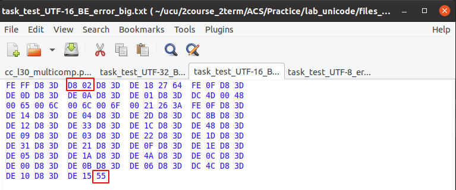


**------../files_with_errors/task_test_UTF-16_error_small1.txt**

code unit: 33 (after this byte should be one more byte to form a code unit in UTF-16)

positions: 68


**Помилка тут**:

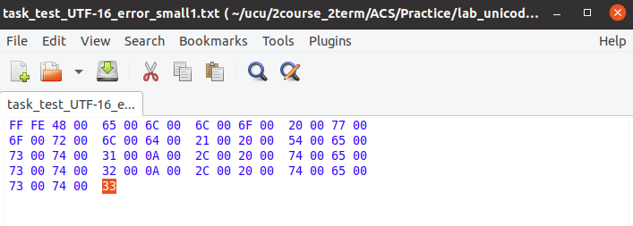


**------../files_with_errors/task_test_UTF-32_BE_error_big.txt**

code unit: 55 (UTF-32 file must contain len(bytes) % 4 == 0)

positions: 172


code unit: 1001f602 (in unicode code of the symbol can not be more than U+10FFFF)

positions: 4  5  6  7

**Помилка тут** (Big endian файл):

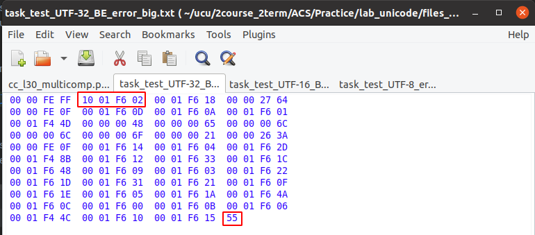


**------../files_with_errors/task_test_UTF-16_error_small3.txt**

code unit: d83d (no low_surrogate_hex after this surrogate hex)

positions: 10  11

**Помилка тут** (little endian файл, high surrogate без low surrogate ):

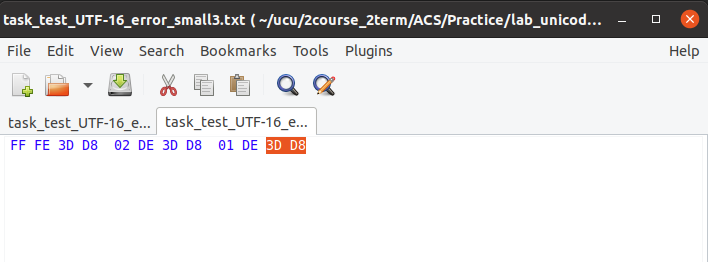


**------../files_with_errors/task_test_UTF-32_error_small2.txt**

code unit: ff (UTF-32 file must contain len(bytes) % 4 == 0)

positions: 12


**Помилка тут**:

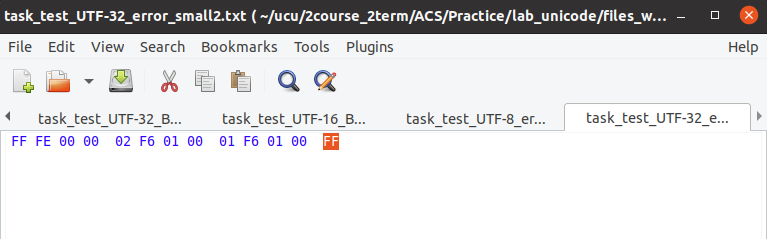


**------../files_with_errors/task_test_UTF-8_error_small1.txt**

code unit: 11011111 (second bitset, after first bitset which starts with 11110, must start with 10)

positions: 1


code unit: 10011000 (forth bitset, after first bitset which starts with 11110, must start with 10)

positions: 3


code unit: 11011000 (third bitset, after first bitset which starts with 11110, must start with 10)

positions: 6


**Помилка тут**:

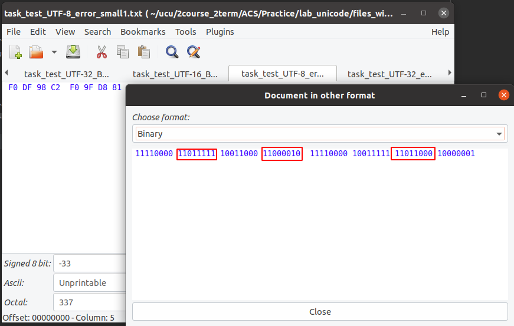


Мало би бути та:

11110000 1**0**011111 10011000 1**0**000010  11110000 10011111 1**0**011000 10000001


**------../files_with_errors/task_test_UTF-32_error_small3.txt**

code unit: 1001f602 (in unicode code of the symbol can not be more than U+10FFFF)

positions: 4  5  6  7

**Помилка тут**:

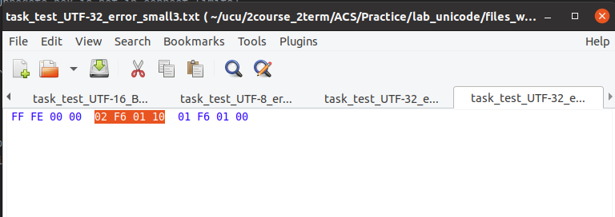


**------../files_with_errors/task_test_UTF-16_error_small2.txt**

code unit: dc3d (high_surrogate_hex is not in correct limits)

positions: 2  3


code unit: d801 (low_surrogate_hex is not in correct limits)

positions: 8  9

**Помилка тут**:

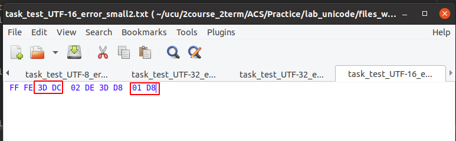


**------../files_with_errors/task_test_UTF-8_error_small2.txt**

code unit: 10110000 (this bitset starts with invalid first bits, which can not be in UTF-8, or before it there is no main byte, which starts with 11110 or 1110 or 110)

positions: 0


code unit: 10011111 (this bitset starts with invalid first bits, which can not be in UTF-8, or before it there is no main byte, which starts with 11110 or 1110 or 110)

positions: 1


code unit: 10011000 (this bitset starts with invalid first bits, which can not be in UTF-8, or before it there is no main byte, which starts with 11110 or 1110 or 110)

positions: 2


code unit: 10000010 (this bitset starts with invalid first bits, which can not be in UTF-8, or before it there is no main byte, which starts with 11110 or 1110 or 110)

positions: 3


code unit: 00011000 (third bitset, after first bitset which starts with 11110, must start with 10)

positions: 6


**Помилка тут**:

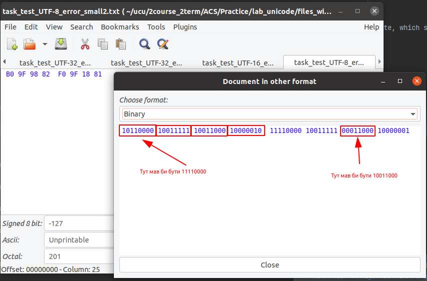


## Додаткове

- очікувані результати для запусків ./run_tests.py знаходяться у ./results

- ви можете самостійно відестувати task 3 на своїх файлах проте ці файли мають містити BOM

- якщо файл не містить BOM то програма вас про це повідомить та не буде його опрацьовувати

- заготовлені файли для тестування у директоріях files та files_with_errors ми готували у [Jeex hex editor](https://www.ubuntugeek.com/jeex-hexadecimal-editor-for-linux.html)

- для створення файлів UTF8, UTF-16, UTF-32, UTF8, UTF-16-BE, UTF-32-BE ми використовували пайтон (./create_tests.py)

- перевірити що файли у директоріях files та files_with_errors мають справді такі формати можна у Clion просто вибравши необхідний формат таким чином 
  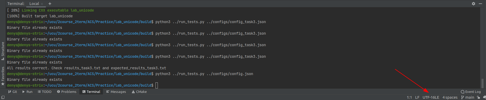
